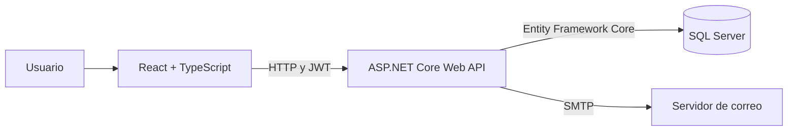

# WebApiSigin

Aplicación web full stack de ejemplo que implementa un flujo de autenticación con registro de usuarios, confirmación de correo electrónico e inicio de sesión mediante JSON Web Tokens (JWT). Una vez autenticado, el usuario puede consultar las listas de productos y tareas almacenadas en SQL Server.

El repositorio contiene el backend, el frontend y un script para crear la base de datos.

## Funcionalidades

- Registro de usuarios con validación de datos.
- Prevención de correos duplicados.
- Envío de un enlace de confirmación mediante SMTP.
- Confirmación de la cuenta usando un token de verificación.
- Inicio y cierre de sesión.
- Autenticación de solicitudes mediante JWT con vigencia de 60 minutos.
- Persistencia de la sesión del frontend en `localStorage`.
- Rutas protegidas para consultar productos y tareas.
- Documentación interactiva de la API con Swagger en desarrollo.

> Actualmente, los módulos de productos y tareas únicamente permiten consultar registros; todavía no incluyen operaciones para crear, editar o eliminar.

## Arquitectura



## Tecnologías utilizadas

### Backend

- .NET 8 y ASP.NET Core Web API.
- Entity Framework Core con el proveedor de SQL Server.
- Autenticación JWT Bearer.
- Swagger/OpenAPI mediante Swashbuckle.
- `System.Net.Mail` para el envío de correos SMTP.
- SHA-256 para el hash de contraseñas en la implementación actual.

### Frontend

- React 19.
- TypeScript.
- Vite 7.
- React Router DOM.
- Axios, con un interceptor que agrega el JWT a las solicitudes.
- Tailwind CSS, Material Tailwind y Flowbite React.
- Lucide React y React Icons.
- Context API y hooks personalizados para autenticación y consumo de la API.

### Datos

- Microsoft SQL Server.
- Tablas principales: `Usuario`, `Producto`, `TodoItems` y `Rol`.
- Script de creación: [`bd.sql`](./bd.sql).

## Estructura del repositorio

```text
WebApiSigin/
├── WebApiSigin/               # API ASP.NET Core
│   ├── Controllers/           # Endpoints HTTP
│   ├── Custom/                # Hash de contraseñas y generación de JWT
│   ├── Models/                # Entidades, DTO y DbContext
│   ├── Services/              # Envío de correo de verificación
│   └── Program.cs             # Configuración de servicios y middleware
├── frontend/                  # Aplicación React
│   └── src/
│       ├── api/               # Cliente Axios
│       ├── components/        # Router, navegación y rutas protegidas
│       ├── context/           # Contexto de autenticación
│       ├── hooks/             # Lógica reutilizable y llamadas a la API
│       └── pages/             # Vistas de la aplicación
├── bd.sql                     # Script de SQL Server
└── WebApiSigin.sln            # Solución de Visual Studio
```

## Requisitos

- [.NET SDK 8](https://dotnet.microsoft.com/download/dotnet/8.0).
- Node.js compatible con Vite 7.
- [pnpm](https://pnpm.io/).
- SQL Server; SQL Server Express también es válido.
- Una cuenta o servidor SMTP para enviar el correo de verificación.

## Configuración

La API necesita una conexión a SQL Server, una clave de firma JWT y los datos del servidor SMTP. Estos valores se leen desde `WebApiSigin/appsettings.json`, un archivo de entorno o variables de entorno.

Configuración esperada, usando valores de ejemplo:

```json
{
  "ConnectionStrings": {
    "CadenaSQL": "Server=localhost\\SQLEXPRESS;Database=DB_TodoList;Trusted_Connection=True;TrustServerCertificate=True"
  },
  "Jwt": {
    "key": "una-clave-larga-aleatoria-y-privada",
    "Issuer": "WebApiSigin",
    "Audience": "WebApiSiginFrontend"
  },
  "MailSettings": {
    "Host": "smtp.example.com",
    "Port": "587",
    "Username": "usuario-smtp",
    "Password": "contrasena-smtp",
    "EnableSsl": "true",
    "From": "no-reply@example.com"
  }
}
```

No se deben subir credenciales reales al repositorio. Para desarrollo local pueden usarse variables de entorno con la notación de ASP.NET Core, por ejemplo:

```powershell
$env:ConnectionStrings__CadenaSQL = "Server=localhost\SQLEXPRESS;Database=DB_TodoList;Trusted_Connection=True;TrustServerCertificate=True"
$env:Jwt__key = "una-clave-larga-aleatoria-y-privada"
$env:Jwt__Issuer = "WebApiSigin"
$env:Jwt__Audience = "WebApiSiginFrontend"
$env:MailSettings__Host = "smtp.example.com"
$env:MailSettings__Port = "587"
$env:MailSettings__Username = "usuario-smtp"
$env:MailSettings__Password = "contrasena-smtp"
$env:MailSettings__EnableSsl = "true"
$env:MailSettings__From = "no-reply@example.com"
```

## Base de datos

Ejecuta [`bd.sql`](./bd.sql) en SQL Server Management Studio o con una herramienta equivalente. El script crea la base `DB_TodoList` y sus tablas.

El archivo fue generado desde una instancia específica de SQL Server Express y contiene rutas locales dentro de la instrucción `CREATE DATABASE`. Si tu instancia tiene otro nombre o directorio de datos, ajusta o elimina las cláusulas `FILENAME` antes de ejecutarlo.

## Ejecución local

### 1. Iniciar la API

Desde la raíz del repositorio:

```powershell
dotnet restore .\WebApiSigin\WebApiSigin.csproj
dotnet run --project .\WebApiSigin\WebApiSigin.csproj
```

En el perfil HTTP incluido, la API se publica en:

- API: `http://localhost:5035`
- Swagger: `http://localhost:5035/swagger`

### 2. Iniciar el frontend

En otra terminal:

```powershell
cd .\frontend
pnpm install
pnpm dev
```

La aplicación queda disponible normalmente en `http://localhost:5173`. El cliente Axios ya está configurado para consumir `http://localhost:5035/api`.

## Flujo de uso

1. El usuario se registra desde `/register`.
2. La API almacena la cuenta como no verificada y envía un correo.
3. El enlace abre `/confirmar/email?token=...` en el frontend.
4. El frontend solicita a la API la confirmación del token.
5. Después de verificar la cuenta, el usuario inicia sesión en `/login`.
6. El JWT se guarda en `localStorage` y permite entrar a `/productos` y `/tareas`.

## Endpoints principales

| Método | Endpoint | Autenticación | Descripción |
| --- | --- | --- | --- |
| `POST` | `/api/Acceso/Registrarse` | Pública | Registra al usuario y envía el correo de confirmación. |
| `GET` | `/api/Acceso/ConfirmarCorreo?token=...` | Pública | Verifica la cuenta asociada al token. |
| `POST` | `/api/Acceso/Login` | Pública | Valida las credenciales y devuelve un JWT. |
| `GET` | `/api/Producto/Lista` | JWT | Devuelve todos los productos. |
| `GET` | `/api/TodoItem/Items` | JWT | Devuelve todas las tareas. |

Para los endpoints protegidos se debe enviar el token en el encabezado:

```http
Authorization: Bearer <token>
```

## Estado actual y mejoras recomendadas

El backend compila correctamente con .NET 8. La compilación de producción del frontend tiene actualmente errores de TypeScript en `src/components/Footer.tsx`: la API de los subcomponentes `Footer.*` utilizada por el código no coincide con la versión instalada de Flowbite React. Es necesario actualizar ese componente o fijar una versión compatible de la dependencia.

El proyecto ya demuestra la integración completa entre interfaz, API, autenticación, correo y base de datos. Antes de considerarlo listo para producción conviene:

- Sustituir SHA-256 por un algoritmo específico para contraseñas, como Argon2, bcrypt o PBKDF2, con salt único por usuario.
- Restringir la política CORS al origen real del frontend.
- Mover las URLs actualmente fijas (`localhost:5035` y `localhost:5173`) a configuración por ambiente.
- Agregar expiración al token de confirmación de correo.
- Incorporar operaciones CRUD, paginación y filtros para productos y tareas si esos módulos van a crecer.
- Añadir pruebas automatizadas para los flujos de registro, confirmación, login y autorización.
- Revisar que las versiones mayores de Entity Framework Core y el framework de destino estén alineadas.

## Licencia

Este repositorio no incluye actualmente un archivo de licencia.
